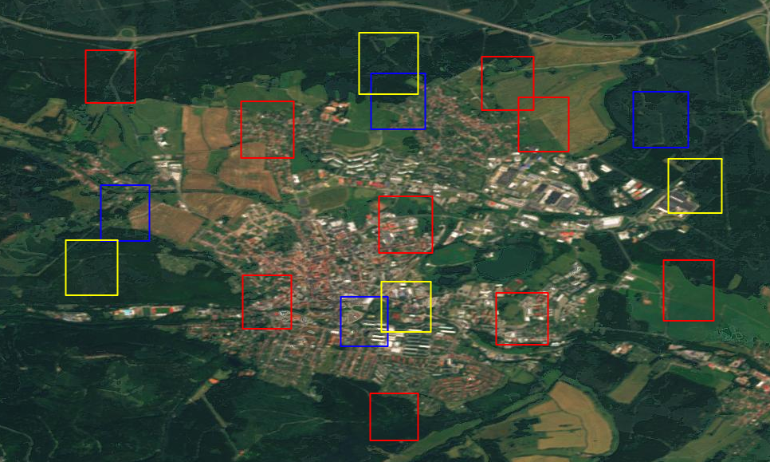

# Metric embeddings for satellite image classification

This repository contains methods for generating and evaluating metric embeddings on satellite images.

## Overview

### Sampling

1. Random sampling  
	Choose every tile randomly across the entire map.
	
	Source: [Sentinel 2 Cloudless](https://s2maps.eu)

2. Cluster sampling  
	Choose tiles in clusters. (required for unsupervised magnet)
	
	Source: [Sentinel 2 Cloudless](https://s2maps.eu)

### Mining 

[Hard Mining](https://arxiv.org/abs/1703.07737)
```
Hermans, Alexander, L. Beyer und B. Leibe (2017). In defense of the
triplet loss for person re-identification. arXiv preprint arXiv:1703.07737.
``` 

1. Hard online mining  
	Find hard samples within the batch.
	
2. Hard offline mining  
	Random search for hard samples over the map.  

TODO: More mining methods from [PyTorch metric learning](https://github.com/KevinMusgrave/pytorch-metric-learning)

### Networks

1. resnext
2. ViT

TODO: Integrate [model zoo](https://cv.gluon.ai/model_zoo/classification.html)
TODO: [EfficientNet](https://github.com/lukemelas/EfficientNet-PyTorch)
TODO: [DEiT](https://github.com/facebookresearch/deit)

### Loss functions

1. [TripletLoss](https://arxiv.org/abs/1404.4661)
2. [QuadrupletLoss](https://arxiv.org/abs/1704.01719)
3. [MagNetLoss](https://arxiv.org/abs/1511.05939)

### Supervised/Unsupervised

1. Train supervised with label from [OSM](https://osmlanduse.org)/[CLC](https://land.copernicus.eu/pan-european/corine-land-cover)
2. Train unsupervised with distance of tile ([Tile2Vec](https://github.com/ermongroup/tile2vec))
	```
	Jean, Neal, S. Wang, A. Samar, G. Azzari, D. Lobell und S. Ermon
	(2019). Tile2Vec: Unsupervised representation learning for spatially distributed data.
	In: Proceedings of the AAAI Conference on Artificial Intelligence, Bd. 33, S. 3967–3974.
	``` 

### Evaluation

1. Single Class Evaluation
	1. Accuracy
	2. [MAP@R](https://arxiv.org/abs/2003.08505)
2. Multi Class Evaluation
	1. Sum error
	2. MAP@R  
		Multi label extension with the key idea of gSil
	3. [gSil](https://www.researchgate.net/publication/262210231_Center-Wise_Intra-Inter_Silhouettes)
3. TODO: Semantic segmentation

## Train

### Data

Place the maps or edit dataProcessors.tiffreader.GEOMAP 

```
	[SENTINEL](https://s2maps.eu) = 'data/s2-de.tif'
	[OSM](https://osmlanduse.org) = 'data/osm_WGS84.tif'
	[CLC](https://land.copernicus.eu/pan-european/corine-land-cover) = 'data/CLCBGR.tif'

```

Default map is germany. Change rect in dataProcesor.imageSampler.ImageSampler

### Config

Edit Config file
```
{
	// neural network architecture
	"network": "transformer|resnext50",

	// loss funktion 
	"loss": "tripletloss|quadrupletloss|magnetloss",

	// use softmax distance (True) or euclidian (False)
	"alt_loss": "True|False",

	// supervised classifier and regressors for validation
	"single_class_classifiers": ["knn", "svc", "rfc", "mlp", "dt"],
	"multi_class_classifiers": ["knn", "svc", "rfc", "mlp", "dt"],

	// tile size of samples
	"image_size": 96,
	"batch_size": 24,
	"mining": ["HARD_NEGATIVE", "HARD_POSITIVE", "RANDOM_HARD_NEGATIVE", "RANDOM_HARD_POSITIVE"],

	// sampling distances for unsupervised learning (distance = image_size*dist)
	"min_pos_dist": 1.0,
	"max_pos_dist": 5.0,
	"min_neg_dist": 10.0,
	"max_neg_dist": 25.0,

	// margin of triplet and quadrupletloss
	"margin": 0.5,

	// number of tiles for validation
	"validation_nb": 5000,

	// label map for validation
	"validation_map": "osm|clc",

	// L2-Norm on network output
	"norm_output": "True|False",

	// use map labels of validation_map (True) or tile distances (False) for training 
	"supervised": "True|False",

	// size of output vector of neural network
	"output_size": 64,

	// use in validation only tiles that dominated by a single class (minimum proportion of the class in the tile)
	"singleClassTreshold": 0.0,

	// run the validation multiple times on different images
	"valIteration": 5,

	// 1.0 for random sampling | 0.0 for cluster sampling
	"random_reset": 1.0

}

```
### Start training
```
python main.py
```

### Show Evaluation
```
tensorboard --port XXXX --logdir results/XXXX
```


## Results

TODO: Add more results

### Best tested results unsupervised
```
{
	"network": "resnext50",
	"loss": "magnetloss",
	"alt_loss": "False",
	"single_class_classifiers": ["rfc", "knn"],
	"multi_class_classifiers": ["rfc", "knn"],
	"image_size": 96,
	"batch_size": 12,
	"mining": [],
	"min_pos_dist": 1.0,
	"max_pos_dist": 5.0,
	"min_neg_dist": 10.0,
	"max_neg_dist": 25.0,
	"margin": 0.5,
	"validation_nb": 5000,
	"validation_map": "osm",
	"norm_output": "True",
	"supervised": "False",
	"output_size": 64,
	"singleClassTreshold": 0.0|0.8,
	"valIteration": 5,
	"random_reset": 0.0
}
```
Single label accuracy: 0.67  
Multi label MAP@1: 0.44  
Multi label MAP@10: 0.35  
Multi label summed error: 1.08  

label images in 3D embedding space, dimension reduction with UMAP 


### Best tested results supervised
```
{
	"network": "resnext50",
	"loss": "magnetloss",
	"alt_loss": "False",
	"single_class_classifiers": ["rfc"],
	"multi_class_classifiers": ["rfc"],
	"image_size": 96,
	"batch_size": 12,
	"mining": [],
	"min_pos_dist": 1.0,
	"max_pos_dist": 5.0,
	"min_neg_dist": 10.0,
	"max_neg_dist": 25.0,
	"margin": 0.5,
	"validation_nb": 5000,
	"validation_map": "osm",
	"norm_output": "True",
	"supervised": "False",
	"output_size": 64,
	"singleClassTreshold": 0.0,
	"valIteration": 5,
	"random_reset": 0.0
}
```
Single label accuracy: 0.77  
Multi label MAP@1: 0.7  
Multi label MAP@10: 0.66  
Multi label summed error: 0.58  


label images in 3D embedding space, dimension reduction with UMAP 
